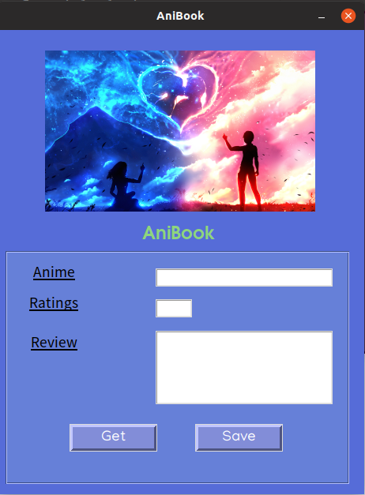

# AniBook
Personal dairy for mentaining database of watched anime

## Screenshot


## Run

```
python ani.py
```

## Feature 
**Save button** - Insert new record in table 

**Get button** - Fetch the rows from table and save it to csv file
...


>Gui made using page

